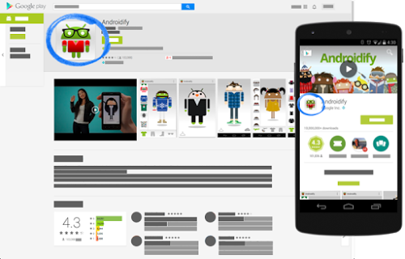
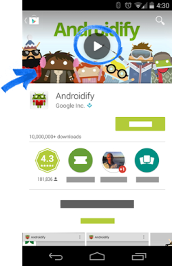
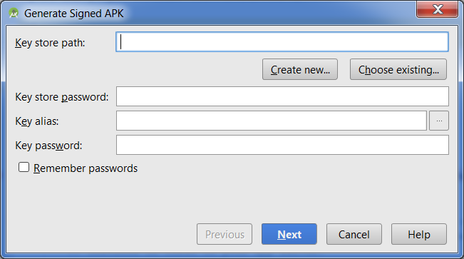
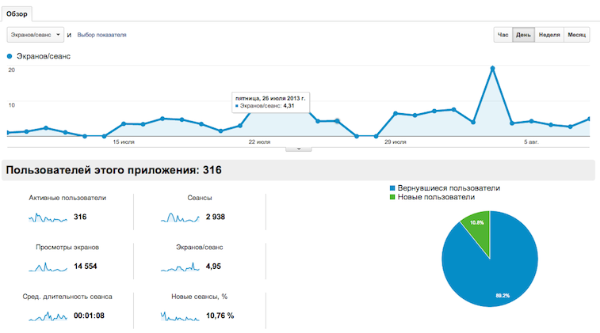
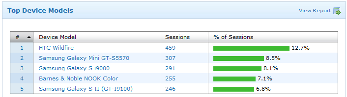
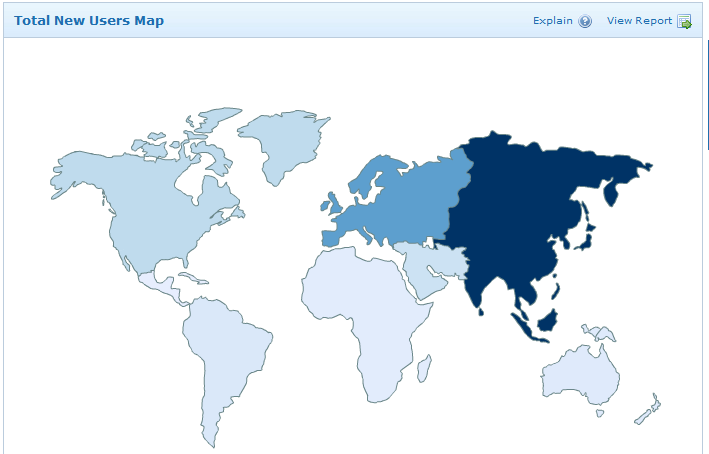
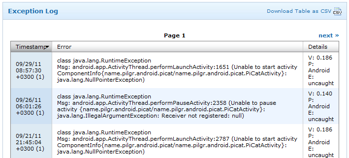

## Публикация приложения в Play Market

### Что требуется сделать для публикации

1. Создать аккаунт разработчика в Google Play Developer Console
2. Подготовить маркетинговые материалы
3. Обеспечить сборку наличием сертификата цифровой подписи
4. Настроить оплату за пользование приложения
5. Отправить сборку в Google Play

### Аккаунт разработчика

Для создания аккаунта используется учетная запись Google:

[https://play.google.com/apps/publish/signup](https://play.google.com/apps/publish/signup)

Стоимость регистрации 25$

#### Пользовательское соглашение

- вы полностью отвечаете за ваш продукт и поставляемый в нём контент
- вы обязуетесь отвечать на вопросы пользователей в течении трёх рабочих дней и на «срочные вопросы согласно определению Google» в течении 24 часов
обязуетесь сохранять конфиденциальность и безопасность пользовательских данных
- вы не пытаетесь обманывать, причинять какой-либо вред или вводить в заблуждение пользователя и компанию Google
- вы не распространяете запрещённый контент. Все Продукты, распространяемые через Google Play, должны соответствовать Правилам программы для разработчиков
- вы разрешаете Google возвращать покупателю полную стоимость Продукта или транзакции внутри приложения от вашего имени, если покупатель запрашивает возврат средств в любой момент после покупки. Удаление продукта не освобождает вас от ответственности перед какого-либо рода выплатами
- в целом, Google снимает с себя любую ответственность, связанную с вашим продуктом

## Подготовка маркетинговых материалов

- иконка
- скриншоты
- APK
- баннер
- текст
- проморолик

### Текст

#### Требования Google Play

- название приложения: не более 30 символов;
- короткое описание: не более 80 символов;
- короткое описание: не более 80 символов;
- полное описание не более 4000 символов.

> Основное отличие краткого описания от полного в том, что полное доступно на декстопе, а короткое создаётся для мобильных устройств.

### Скриншоты

Максимум скриншотов, доступных для загрузки к одному приложению — восемь штук. Минимум — два. Сколько скриншотов загружать — вопрос открытый. С одной стороны, нам нужно наглядно и с выгодной стороны показать функциональные особенности приложения для пользователя. С другой стороны, нужно сформировать у пользователя стремление загрузить приложение и посмотреть, что же там есть ещё, чего не было на скриншотах. Поэтому, прежде чем делать максимальное количество скриншотов, нужно подумать об их необходимости.

Для создания скриншотов прямиком с устройства существует приложение Clean Status Bar. Оно очистит статус бар от мусора: сделает батарею полной, выставит 12:00 на часах и по желанию отобразит иконки 3G и WiFi.

#### Требования Google Play

- формат JPEG или 24-битный PNG (без альфа-канала)
- не менее 320 пикселей
- не более 3840 пикселей
- соотношение сторон не должно превышать 2:1

### Иконка

Небольшое изображение, идентифицирующее наше приложение среди остальных.



#### Требования Google Play

- 32-битный PNG (с альфа-каналом)
- размеры: 512 х 512 пикселей
- максимальный размер файла: 1024 КБ

### Проморолик

Добавление ролика само по себе опционально, но если мы заботимся о клиенте и пользователях и у нас есть время и бюджет, то это лучше сделать.

Видео должны быть короткими (от 30 секунд до 2 минут) и демонстрировать самые привлекательные функции приложения. На устройстве с Android 4.4 или более поздней версии можно записать видео с устройства с помощью команды оболочки ADB screenrecord.

#### Требования Google Play

- указывайте URL отдельного видео на YouTube, а не плейлиста или канала
- не используйте видео с возрастным ограничением в качестве проморолика
- используйте полную ссылку на видео YouTube вместо сокращенной

### Баннер

На картинке для раздела «Рекомендуемые» можно продемонстрировать потенциальным пользователям графические возможности приложения. Это изображение необходимо, чтобы показывать приложение на разных страницах Google Play. Если загружен проморолик, поверх неё будет расположена кнопка:



#### Требования Google Play

- JPEG или 24-битный PNG (без альфа-канала)
- 1024х500 пикселей

#### Советы

- не размещайте важную информацию по краям, особенно в нижней трети рамки.
- логотип лучше размещать по центру, выровняв по горизонтали и вертикали.
для текста используйте крупный шрифт.
- помните, что картинка может быть показана отдельно, без значка приложения.

### Возрастные ограничения

#### Требования Google Play

Система возрастных ограничений для игр и приложений учитывает особенности законодательства и культуры отдельных стран. Это позволяет разработчикам более точно определять ограничения для контента и распространять приложения среди той аудитории, для которой они предназначены.

Чтобы установить возрастное ограничение, войдите в Google Play Developer Console и заполните специальную анкету для каждого из своих приложений. Программы, которым не присвоен рейтинг, могут быть заблокированы для отдельных пользователей или стран.

Вы обязаны заполнять анкеты для установления возрастных ограничений и соблюдать рекомендации по оценке контента. Приложения, которым не присвоено ограничение, могут быть удалены из Google Play.

В анкете давайте правдивые и максимально точные ответы, иначе приложение может быть удалено или заблокировано.

### Технические требования к apk-файлу

- размер apk-файла не должен превышать более 100 Мб.
Если приложение больше 100 Мб, то его можно разбиться на части: основная —
до 100 Мб и несколько дополнительных APK Expansion Files до 2 Гб каждый
- apk-файл не должен быть debuggable
- apk-файл должен быть подписан файлом цифровой подписи

### Обеспечение сборки наличием цифровой подписи

Цифровая подпись необходима для того, чтобы Google Play мог идентифицировать разработчика, и в дальнейшем только этот разработчик мог обновлять/изменять приложение. К тому же, на цифровую подпись завязаны множество сервисов, таких как Facebook SDK, Vk SDK и большинство Google сервисов. 

Цифровая подпись помещается в хранилище ключей (файл с расширением .keystore или .jks ). К хранилищу обязаны прилагаться:

- store password — пароль к хранилищу ключей;
- key alias — название ключа в хранилище;
- key password — пароль к ключу.

**Внимание!** Хранилище ключей должно находиться в надежном месте. Если вы потеряете доступ к хранилищу или пароли к нему, то назад пути нет. Вам придётся опубликовать приложение с новым названием пакета и новым ключом. Кроме того, потребуется обновить описание исходного приложения и закрыть к нему общий доступ. Потеря файла или паролей обернётся для вашего приложения полной трагедией: пользователям придётся удалять текущую версию и скачивать из Google Play новую, а вы потеряете статистику, скачивания, аудиторию.

Хорошей практикой считается подписывать группу своих приложений одной и той же цифровой подписью. Во-первых вы не запутаетесь в них, а во-вторых вы получаете ряд приятных бонусов. Например можно организовать безопасное общение между своими приложениями через Intent.

Подписать приложение можно в Android Studio (Build -> Generate Signed APK):



### Настройка оплаты за пользование приложением

Начать следует с того, что в своем аккаунте разработчика после загрузки приложения вы можете выбрать тип приложения: платное или бесплатное.

#### Смена типа приложения

Вы можете сделать платное приложение бесплатным без повторной выкладке приложения в стор. Но для того, чтобы сделать бесплатное приложение платным, вам нужно будет выкладывать приложение в стор с новым названием пакета и указанием цены.

### Настройка альфа- и бета-тестирования

Альфа- и бета-тестирование позволяет опробовать ваше приложение на узком круге пользователей. Существует открытое и закрытое тестирование. В обоих случаях тестовая группа пользователей не сможет оставлять публичные отзывы в Google Play — только личные, которые не являются общедоступными. В любом случае полезно предложить им дополнительный общий канал для обратной связи. Стоит отметить, что неважно, публикуете вы приложение впервые, обновляете существующее или меняете его описание, изменения будут доступны в Google Play не мгновенно, а только через пару часов.

[https://support.google.com/googleplay/android-developer/answer/3131213](https://support.google.com/googleplay/android-developer/answer/3131213)

### Поэтапное внедрение обновлений

Обновления приложений можно внедрять поэтапно, начав с небольшой части пользователей, которая указывается в процентах, и постепенно увеличивая их количество. Поэтапное внедрение доступно только для обновлений приложения, а не для его первоначальной версии. Выбор пользователей происходит абсолютно случайным образом и вы никак не можете указать какие-либо параметры выбора. Также вы не можете откатить версию приложения у пользователей, которые уже установили обновление.

### Публикация приложения

1. Откройте Google Play Developer Console.
2. Выберите приложение.
3. В меню слева откройте раздел Управление версиями.
4. Рядом с названием нужной версии нажмите Продолжить.
5. Просмотрите проект выпуска и при необходимости внесите изменения.
6. Выберите Посмотреть. На открывшейся странице можно убедиться, что ничего не мешает выпустить версию приложения для пользователей.
7. Просмотрите все предупреждения и сообщения об ошибках.
8. Для запущенных продуктов укажите процент внедрения версии. Если вы выпускаете рабочую версию впервые, эта настройка будет недоступна.
9. Выберите Подтверждение внедрения версии. Если вы выпускаете приложение впервые, оно будет опубликовано для всех пользователей Google Play в выбранных вами странах.

## Аналитика приложения

### Аналитика поведения пользователей

- количество ежедневной аудитории (DAU)
- пути пользователей в приложении
- насколько часто используются функции приложения
- достижения целей (регистрация, покупка, три захода в течении месяца, ...)
- частота возврата аудитории (retention rate)

Google Analitics: [http://www.google.com/intl/ru_ALL/analytics/features/mobile-app-analytics.html](http://www.google.com/intl/ru_ALL/analytics/features/mobile-app-analytics.html)



### Добавление Google Analitics в приложение

[https://developers.google.com/analytics/devguides/collection/android/v4/](https://developers.google.com/analytics/devguides/collection/android/v4/)

### Flurry

[https://y.flurry.com/](https://y.flurry.com/)





```
public class MyActivity extends Activity {

    @Override
    public void onStart()
    {
        super.onStart();
        FlurryAgent.onStartSession(
          this, "Your unique application key");
    }

    @Override
    public void onStop()
    {
        super.onStop();
        FlurryAgent.onEndSession(this);
    }
}
```