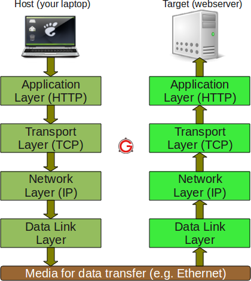
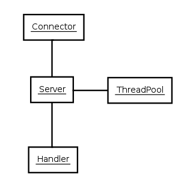
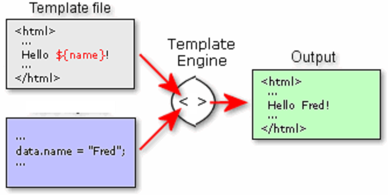

# Tomcat и Jetty
# Сервлеты
# Вебсокеты
# Шаблонизация веб-страниц

---

# Сетевое взаимодействие

### Сетевой стек



### IP (Internet Protocol)

Обеспечивает доставку пакетов данных между любыми узлами сети через произвольное число промежуточных узлов (маршрутизаторов).

1. Не гарантирует надёжной доставки пакета до адресата (дублирование пакетов, нарушение порядка, потеря)

### TCP (Transmission Control Protocol)

Надёжный протокол с установлением соединения.

1. Подтверждение получения пакетов
2. Отслеживание ошибок и их исправление
3. Управление потоком передачи данных

#### Сервер

```Java
package server;

import java.io.*;
import java.net.*;

class Server {
    public static void main(String argv[]) throws Exception {
        ServerSocket socket = null;
        try {
            socket = new ServerSocket(7005);

            Socket connection = socket.accept();
            System.out.println("Connected: " + connection.getInetAddress());

            try (InputStream in = connection.getInputStream();
                OutputStream out = connection.getOutputStream()) {

                byte[] buffer = new byte[512];
                int bytesReaded = in.read(buffer);

                String request = new String(buffer, 0, bytesReaded);
                System.out.println(request);
                
                out.write(request.getBytes());
                out.flush();
            }
        } catch (IOException e) {
            e.printStackTrace();
        } finally {
            if (socket != null) {
                socket.close();
            }
        }
    }
}
```

#### Клиент

```Java
package client;

import java.io.*;
import java.net.*;

class Client {
    public static void main(String argv[]) throws Exception {
        Socket socket = null;
        try {
            socket = new Socket("localhost", 7005);

            try (InputStream in = socket.getInputStream();
                OutputStream out = socket.getOutputStream()) {

                out.write("hello!\n".getBytes());
                
                byte[] buffer = new byte[512];
                int bytesReaded = in.read(buffer);

                String response = new String(buffer, 0, bytesReaded);
                System.out.println(response);
            }
        } catch (IOException e) {
            e.printStackTrace();
        } finally {
            if (socket != null) {
                socket.close();
            }
        }
    }
}

```

### HTTP (HyperText Transfer Protocol)

Основа HTTP - технология «клиент-сервер», то есть предполагается существование:

1. Клиентов, которые инициируют соединение и посылают запрос
2. Ссервера, который ожидают соединение для получения запроса, производит необходимые действия и возвращает результат

#### Структура протокола

##### Запрос

```
Метод URI версия
Заголовки

Тело
```

```
POST /user/add HTTP/1.1
Host: www.test.com
Content-Type: application/json
Connection: keep-alive
Content-Length: 17

{ "name": "Joe" }
```

##### Ответ

```
Версия Код ответа Описание
Заголовки

Тело
```

```
HTTP/1.1 404 Not Found
Content-Type: text/html
Connection: close
Content-Length: 7

<html/>
```

#### Методы

- GET - получение данных
- HEAD - получение только заголовков
- POST - отправка данных на сервер
- ...

#### Коды ответа

- 1xx - информационные
- 2xx - успешное выполнение
- 3xx - перенаправление
- 4xx - ошибка клиента
- 5xx - ошибка сервера

##### 2xx

- 200 OK

##### 3xx

- 301 Moved Permanently - перемещен навсегда
- 304 Not Modified - не изменился, можно использовать кеш (conditional GET) 

##### 4xx

- 400 Bad Request - неправильный синтаксис щапроса
- 401 Unauthorized - требуется авторизация
- 403 Forbidden - нет доступа (неверная авторизация, недостаточно прав)
- 404 Not Found

##### 5xx

- 500 Internal Server Error - внутренняя ошибка
- 502 Bad Gateway - проксируемый сервер отвечает с ошибкой
- 504 Gateway Timeout - проксируемый сервер не отвечает

### Сервлет

Java класс, который вызывается для обработки HTTP запроса.

### Контейнер сервлетов

Приложение управляющее жизненным циклом сервлета и делающее его вызов

#### Жизненный цикл сервлета

1. В случае отсутствия сервлета в контейнере
- Класс сервлета загружается контейнером
- Контейнер создает экземпляр класса сервлета
- Контейнер вызывает метод init(). За весь жизненный цикл метод init() вызывается только один раз
2. Обслуживание клиентского запроса
- Каждый запрос обрабатывается в своем отдельном потоке
- Контейнер вызывает метод service() для каждого запроса. Этот метод определяет тип пришедшего запроса и распределяет его в соответствующий этому типу метод для обработки запроса
- Вызываются doGet, doPost в зависимотси от метода в запросе
3. При удалении сервлета вызывается destroy()

```Java
import java.io.IOException;
import java.io.PrintWriter;
import javax.servlet.ServletException;
import javax.servlet.http.HttpServlet;
import javax.servlet.http.HttpServletRequest;
import javax.servlet.http.HttpServletResponse;
import javax.servlet.http.HttpSession;

public class NewServlet extends HttpServlet {
   
    @Override
    protected void doGet(HttpServletRequest request, HttpServletResponse response) throws ServletException, IOException {
        
        response.setContentType("text/html;charset=UTF-8");

        PrintWriter out = response.getWriter();
        try {
            out.println("<html>");
            out.println("</html>");
        } finally {
            out.close();
        }
    } 
}
```

### Jetty

[https://eclipse.org/jetty/](https://eclipse.org/jetty/)

1. Может работать как HTTP сервер
2. Может быть встроен в приложение
3. Позволяет запускать код для обработки запроса от клиента (сервлет)
4. Очень простой 



##### Встраиваем Jetty:

```Java
import java.io.IOException;
import javax.servlet.ServletException;
import javax.servlet.http.HttpServlet;
import javax.servlet.http.HttpServletRequest;
import javax.servlet.http.HttpServletResponse;

public class Hello extends HttpServlet
{
    @Override
    protected void doGet(
        HttpServletRequest request,
        HttpServletResponse response)
        throws ServletException, IOException
    {
        response.setContentType("text/html");
        response.setStatus(HttpServletResponse.SC_OK);
        response.getWriter().println("<h1>Hello</h1>");
    }
}
```

```Java
import org.eclipse.jetty.servlet.ServletHandler;

public class Server {
    public static void main( String[] args ) throws Exception
    {
        ServletHandler handler = new ServletHandler();

        handler.addServletWithMapping(Hello.class, "/");

        org.eclipse.jetty.server.Server server =
            new org.eclipse.jetty.server.Server(8080);

        server.setHandler(handler);

        server.start();
        server.join();
    }
}
```

### Tomcat

[https://tomcat.apache.org/](https://tomcat.apache.org/)

1. Старейший контейнер сервлетов
2. Более сложный в поддержке и настройке, чем Jetty

### Вебсокеты

В архитектуре «клиент-сервер» клиент взаимодействие происходит по инициативе клиента, но что делать, если произвести взаимодействие требуется со стороны сервера?

#### Long Poll (длинный запрос)

1. Клиент посылает запрос серверу и блокируется на чтении ответа из сокета
2. Сервер, когда будет нужно, пишет в сокет данные
3. Клиент просыпается и обрабатывает полученные данные

Технология вебсокет призвана добавить гибкость взаимодействия через TCP сокеты в традиционное взаимодействие клиента и сервера через HTTP.

```Java
import java.io.IOException;
 
import javax.websocket.OnClose;
import javax.websocket.OnMessage;
import javax.websocket.OnOpen;
import javax.websocket.Session;
import javax.websocket.server.ServerEndpoint;
 
@ServerEndpoint("/websocket")
public class WebSocketTest {
 
    @OnMessage
    public void onMessage(String message, Session session)
        throws IOException, InterruptedException {

        System.out.println("Received: " + message);
        session.getBasicRemote().sendText("Hello");
        
        Thread.sleep(5000);

        session.getBasicRemote().sendText("Bye");
    }
 
    @OnOpen
    public void onOpen() {
        System.out.println("Client connected");
    }
 
    @OnClose
    public void onClose() {
        System.out.println("Connection closed");
    }
}
```

```JS
var webSocket = 
    new WebSocket('ws://localhost:8080/websocket');

webSocket.onerror = function(event) {
    onError(event)
};

webSocket.onopen = function(event) {
    onOpen(event)
};

webSocket.onmessage = function(event) {
    onMessage(event)
};

function onMessage(event) {
    alert(event.data);
}

function onOpen(event) {
}

function onError(event) {
    alert(event.data);
}
```

### Шаблонизация текста

Механизм замены в статическом тексте некоторых элементов во время выполнения.




##### helloworld.ftl

```
<html>
<head>
  <title>${title}
</head>
<body>
  <h1>${title}</h1>
</body>
</html>
```

```Java
Map<String, Object> input = new HashMap<String, Object>();
input.put("title", "Hello");

Configuration cfg = new Configuration();
Template template = cfg.getTemplate("helloworld.ftl");

Writer consoleWriter = new OutputStreamWriter(System.out);
template.process(input, consoleWriter);

Writer fileWriter = new FileWriter(new File("output.html"));
try {
    template.process(input, fileWriter);
} finally {
    fileWriter.close();
}
```