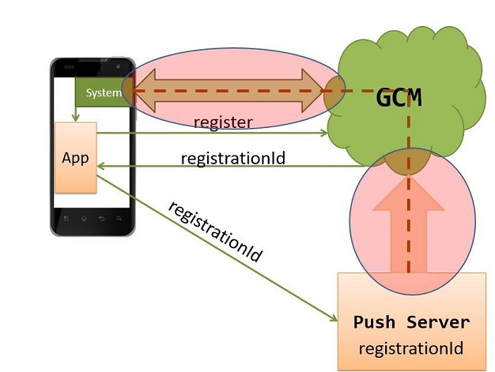

## Push уведомления в Android через Google Cloud Messaging (GSM)

Push уведомления - сообщения поступающие от сервера к клиенту без запроса со стороны клиента.

1. Приложение отправляет запрос в GCM
2. Приложение получает строку-токен
3. Токен приложение отправляет на свой сервер
4. Сервер запоминает токен и будет использовать его для отправки уведомлений



#### Регистрация в Google API

1. По ссылке [https://console.developers.google.com/](https://console.developers.google.com/)  следует зарегестрировать аккаунт, если его еще нет, после этого нужно создать проект под приложение.
2. В разделе APIs & auth > APIs подключаем Cloud Messaging for Android.
3. Создаем credentials, получаем API key
4. Запоминаем ID проекта вида - это будет значение SENDER_ID

#### AndroidManifest.xml

```
<manifest package="___.gcm" ...>
  <uses-sdk 
    android:minSdkVersion="8" 
    android:targetSdkVersion="17"/>
  <uses-permission 
    android:name="android.permission.INTERNET" />
  <uses-permission 
    android:name="android.permission.GET_ACCOUNTS" />
  <uses-permission 
    android:name="android.permission.WAKE_LOCK" />
  <uses-permission
    android:name="com.google.android.c2dm.permission.RECEIVE" />
  
  <permission 
    android:name="___.gcm.permission.C2D_MESSAGE"
    android:protectionLevel="signature" />
  <uses-permission 
    android:name="___.gcm.permission.C2D_MESSAGE" />
  
  <application ...>
    <receiver
      android:name="com.google.android.gms.gcm.GcmReceiver"
      android:exported="true"
      android:permission="com.google.android.c2dm.permission.SEND" >
      <intent-filter>
        <action android:name="com.google.android.c2dm.intent.RECEIVE" />
        <category android:name="___.gcm" />
      </intent-filter>
      <intent-filter>
        <action android:name="com.google.android.c2dm.intent.REGISTRATION" />
        <category android:name="___.gcm" />
      </intent-filter>
    </receiver>
    <service
      android:name="___.MyGcmListenerService"
      android:exported="false" >
      <intent-filter>
        <action android:name="com.google.android.c2dm.intent.RECEIVE" />
      </intent-filter>
    </service>
    <service
      android:name="___.MyTokenRefreshListenerService"
      android:exported="false">
      <intent-filter>
        <action android:name="com.google.android.gms.iid.InstanceID" />
      </intent-filter>
    </service>
  </application>
</manifest>
```

#### Получение токена пользователя в Android приложении

Для регистрации приложения и получения токена используется следующий код:

```
try {
  InstanceID instanceID = InstanceID.getInstance(this);
  String token = instanceID.getToken(
    SENDER_ID, GoogleCloudMessaging.INSTANCE_ID_SCOPE, null);
} catch (IOException e) {
  e.printStackTrace();
}
```

> Код нельзя вызывать из главного потока 

SENDER_ID - ID проекта (см. пункт Регистрация в Google API)

#### Обновление токена пользователя

```
public class MyTokenRefreshListenerService
  extends InstanceIDListenerService {

  @Override
  public void onTokenRefresh() {
    // Получить токен снова
  }
}
```

#### Отправка токена на сервер

ПОлная свобода выбора как это сделать. Кроме токена можно дополнительно передавать информацию о пользователе - токен уникален и позволяет идентифицировать пользователя.

#### Подписка приложения на уведомления

```
GcmPubSub subscription = GcmPubSub.getInstance(this);
subscription.subscribe(
  registrationToken, "/topics/news", null);
```

#### Прием Push-уведомлений

```
import com.google.android.gms.gcm.GcmListenerService;

public class MyGcmListenerService extends GcmListenerService {
  @Override
  public void onMessageReceived(String from, Bundle data) {
    String message = data.getString("message");
  }
}
```

#### Отправка Push-уведомления

Для отправки уведомления нужно отправить POST запрос по адресу [https://gcm-http.googleapis.com/gcm/send](https://gcm-http.googleapis.com/gcm/send) следующего содержания:

```
Content-Type: application/json
Authorization: key=API key

{
  "to": "/topics/news",
    или
  "to": token,
  "time_to_live": секунд,
  "notification": {
      "body": "...",
      "title": "...",
      "icon" : "..."
  }
}
```

### Firebase Cloud Messaging (FCM)

Новая служба рассылки уведомлений купленная Google и сейчас позиционирующаяся как замена Google Cloud Messaging (GSM).

Типы уведомлений:

1. Простые уведомления (Notification Messages) это стандартные popup уведомления, с определенными Вами данными (payload)
2. Уведомления в формате JSON (Data Messages), которые доставляются к вам в приложение и вы сами определяете что ваше приложение с этим всем делает

#### Установка

Для подключения в проект в Android Studio нужно выбрать Tools -> Firebase, в диалоговой панели выбрать Cloud Messaging и нажать Connect to Firebase. После этого появится кнопка Add FCM to your app, по ее нажатию будет поднята вся необходимая инфраструктура.

#### Получение и удаление токенов

Нужно создать класс унаследованный от FirebaseInstanceIdService и переопределить метод onTokenRefresh:

```
public class MyFirebaseInstanceIdService
  extends FirebaseInstanceIdService {

  @Override
  public void onTokenRefresh() {
    String refreshedToken = 
      FirebaseInstanceId.getInstance().getToken();
    sendRegistrationToServer(refreshedToken);
  }
}
```

Также следует изменить манифест (AndroidManifest.xml):

```
<service
  android:name=".MyFirebaseInstanceIDService">
  <intent-filter>
    <action android:name="com.google.firebase.INSTANCE_ID_EVENT"/>
  </intent-filter>
</service>
```

#### Получение уведомлений

```
public class MyFirebaseMessagingService
  extends FirebaseMessagingService {

  @Override
  public void onMessageReceived(RemoteMessage message) {
    if (remoteMessage.getData().size() > 0) {
        String data = remoteMessage.getData();
    }

    if (remoteMessage.getNotification() != null) {
        String text = remoteMessage.getNotification().getBody();
    }
  }
}
```

##### AndroidManifest.xml

```
<service
  android:name=".MyFirebaseMessagingService">
  <intent-filter>
    <action android:name="com.google.firebase.MESSAGING_EVENT"/>
  </intent-filter>
</service>
```

#### Отправка Push-уведомления

Для отправки уведомления нужно отправить POST запрос по адресу [https://gcm-http.googleapis.com/gcm/send](https://gcm-http.googleapis.com/gcm/send) следующего содержания:

```
Content-Type: application/json
Authorization: key=API key

{
  "notification": {
    "title": "...",
    "text": "..."
  },
  "data": {
    "keyname": "any value "
  },
  "to" : token или topic
} 
```
