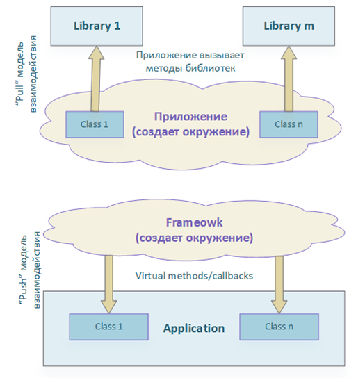
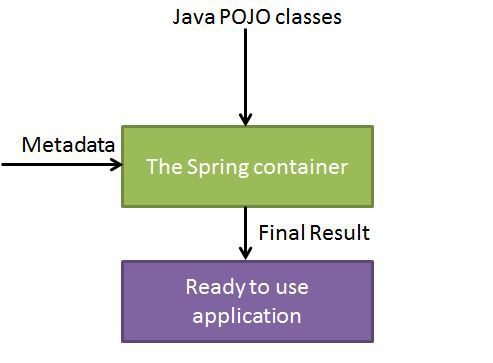
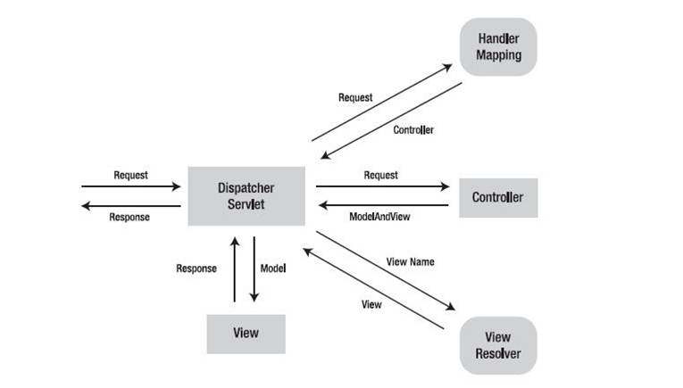
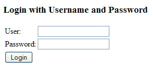
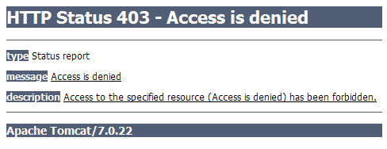

## Spring framework

Универсальный фреймворк с открытым исходным кодом для Java-платформы.

Фреймворк был впервые выпущен под лицензией Apache 2.0 license в июне 2003 года. Первый стабильный релиз 1.0 был выпущен в марте 2004. Spring 2.0 был выпущен в октябре 2006, Spring 2.5 — в ноябре 2007, Spring 3.0 в декабре 2009, и Spring 3.1 в декабре 2011. Текущая версия — 5.0.1.

Spring обеспечивает решения многих задач, с которыми сталкиваются Java-разработчики и организации, которые хотят создать информационную систему, основанную на платформе Java. 

Считается, что Spring реализует модель разработки, основанную на лучших стандартах индустрии.

### Модули

Spring - набор библиотек и фреймворков доступных в виде jar-файлов. Большинство этих фреймворков может работать независимо друг от друга, однако они обеспечивают большую функциональность при совместном их использовании.

- Inversion of Control-контейнер: конфигурирование компонентов приложений и управление жизненным циклом Java-объектов.
- Фреймворк аспектно-ориентированного программирования (парадигма программирования, основанная на идее разделения функциональности для улучшения разбиения программы на модули). Пример нарушения АОП: логирование
- Фреймворк доступа к данным: работает с системами управления реляционными базами данных на Java-платформе, используя JDBC- и ORM-средства и обеспечивая решения задач, которые повторяются в большом числе Java-based environments.
- Фреймворк управления транзакциями: координация различных API управления транзакциями и инструментарий настраиваемого управления транзакциями для объектов Java.
- Фреймворк MVC: каркас, основанный на HTTP и сервлетах, предоставляющий множество возможностей для расширения и настройки (customization).
- Фреймворк удалённого доступа: конфигурируемая передача Java-объектов через сеть в стиле RPC (Remote Procedure Call), поддерживающая RMI, CORBA, HTTP-based протоколы, включая web-сервисы (SOAP).
- Фреймворк аутентификации и авторизации: конфигурируемый инструментарий процессов аутентификации и авторизации, поддерживающий много популярных и ставших индустриальными стандартами протоколов, инструментов, практик через дочерний проект Spring Security (ранее известный как Acegi).
- Фреймворк удалённого управления: конфигурируемое представление и управление Java-объектами для локальной или удалённой конфигурации с помощью JMX.
- Фреймворк работы с сообщениями: конфигурируемая регистрация объектов-слушателей сообщений для прозрачной обработки сообщений из очереди сообщений с помощью JMS, улучшенная отправка сообщений по стандарту JMS API.
- Тестирование: каркас, поддерживающий классы для написания модульных и интеграционных тестов.
- Фреймворк Security: авторизация и аутентификация, доступ к данным, методам и т.п. OAuth, LDAP.

### IoC-контейнер (Inversion of Control)

- Вместо программирования на реализации следует программировать на интерфейсах
- Объект не создает свои зависимости, а получает - внедрение зависимостей (DI, Dependency Injection)



Spring IoC-контейнер создаёт объекты, связывает их вместе, настраивает и управляет ими от создания до момента уничтожения.

Для управления компонентами, из которых состоит приложение, Spring Container использует Внедрение Зависимостей (DI). Эти объекты называются Spring Beans.

> Spring Bean должен иметь конструктор без аргументов, следовать getFoo (или isFoo для boolean) и setFoo конвенции, реализовать java.io.Serializable

Spring Container получает инструкции какие объекты инстанциировать и как их конфигурировать через метаданные.

Метаданные могут быть получены 3 способами:
- XML
- Аннотации Java
- Java код



> POJO (англ. Plain Old Java Object) — «старый добрый Java-объект», простой Java-объект, не унаследованный от какого-то специфического объекта и не реализующий никаких служебных интерфейсов сверх тех, которые нужны для бизнес-модели.

В Spring имеется 2 различных вида контейнеров:
1. Spring BeanFactory Container
2. Spring ApplicationContext Container

#### Spring BeanFactory Container

Самый простой контейнер, который обеспечивает базовую поддержку DI и который основан на интерфейсе org.springframework.beans.factory.BeanFactory.

Наиболее часто используемая реализация интерфейса BeanFactory – XmlBeanFactory. XmlBeanFactory получает метаданные из конфигурационного XML файла и использует его для создания настроенного приложения или системы.

BeanFactory обычно используется тогда, когда ресурсы ограничены (мобильные устройства). Поэтому, если ресурсы не сильно ограничены, то лучше использовать ApplicationContext.

##### message-bean.xml

```
<beans>
  <bean id="fromBeanMessage" class="my.Message">
    <property name="message" 
      value="This is message from simple bean."/>
  </bean>
</beans>
```

```
package my;

import java.io.Serializable;

public class Message implements Serializable {
    private String message;

    public String getMessage() {
        return message;
    }

    public void setMessage(String message) {
        this.message = message;
    }
}
```

```
package my;

import org.springframework.beans.factory.xml.XmlBeanFactory;
import org.springframework.core.io.ClassPathResource;

public class MessageRunnerWithBeanFactory {
  public static void main(String[] args) {
    XmlBeanFactory factory = 
      new XmlBeanFactory(
        new ClassPathResource("message-bean.xml"));
    Message message = 
      (Message) factory.getBean("fromBeanMessage");
    System.out.println(message.getMessage());
  }
}
```

#### Жизненный цикл бина

Для управления контейнером жизненным циклом бина, вы можете использовать методы с аннотациями @PostConstruct и @PreDestroy.

### Фреймворк MVC

Фреймворк Spring MVC обеспечивает архитектуру паттерна Model — View — Controller (Модель — Отображение (Вид) — Контроллер) при помощи слабо связанных готовых компонентов. Паттерн MVC разделяет аспекты приложения (логику ввода, бизнес-логику и логику UI), обеспечивая при этом свободную связь между ними.

- Model (Модель) инкапсулирует данные приложения, в целом они будут состоять из POJO.
- View (Вид) отвечает за отображение данных Модели, — как правило, генерируя HTML, которые мы видим в своём браузере.
- Controller (Контроллер) обрабатывает запрос пользователя, создаёт соответствующую Модель и передаёт её для отображения в Вид.

#### DispatcherServlet

Вся логика работы Spring MVC построена вокруг DispatcherServlet, который принимает и обрабатывает все HTTP-запросы (из UI) и ответы на них.



1. После получения HTTP-запроса DispatcherServlet обращается к интерфейсу HandlerMapping, который определяет, какой Контроллер должен быть вызван, после чего, отправляет запрос в нужный Контроллер.
2. Контроллер принимает запрос и вызывает соответствующий служебный метод, основанный на GET или POST. Вызванный метод определяет данные Модели, основанные на определённой бизнес-логике и возвращает в DispatcherServlet имя Вида (View).
3. При помощи интерфейса ViewResolver DispatcherServlet определяет, какой Вид нужно использовать на основании полученного имени.
4. После того, как Вид (View) создан, DispatcherServlet отправляет данные Модели в виде атрибутов в Вид, который в конечном итоге отображается в браузере.

#### Конфигурирование

Необходимо связать (замапить) запросы, которые Вы хотите обработать при помощи DispatcherServlet, используя мапинг URL в файле web.xml:

```
<web-app id = "WebApp_ID" version = "2.4">
   <servlet>
      <servlet-name>HelloWeb</servlet-name>
      <servlet-class>
         org.springframework.web.servlet.DispatcherServlet
      </servlet-class>
      <load-on-startup>1</load-on-startup>
   </servlet>

   <servlet-mapping>
      <servlet-name>HelloWeb</servlet-name>
      <url-pattern>*.jsp</url-pattern>
   </servlet-mapping>
</web-app>
```

Файл web.xml будет находиться в каталоге WebContent/WEB-INF. После инициализации HelloWeb, фреймворк попытается загрузить контекст приложения из файла с именем [servlet-name]-servlet.xml, находящегося в каталоге WebContent/WEB-INF. В нашем случае, это будет HelloWeb-servlet.xml.

Далее, тэг <servlet-mapping> указывает, какие веб-адреса обрабатываются каким DispatcherServlet'ом. В нашем случае, все HTTP-запросы, заканчивающиеся на ".jsp", будут обработаны HelloWeb.

##### WebContent/WEB-INF/HelloWeb-servlet.xml

```
<beans>
   <context:component-scan base-package = "my" />

   <bean class =
      "org.springframework.web.servlet.view.InternalResourceViewResolver">
      <property name = "prefix" value = "/WEB-INF/views/" />
      <property name = "suffix" value = ".jsp" />
   </bean>
</beans>
```

#### Определение Контроллера

DispatcherServlet отправляет запрос контроллерам для выполнения определённых функций. Аннотация @Controller указывает, что конкретный класс является контроллером. Аннотация @RequestMapping используется для мапинга (связывания) с URL для всего класса или для конкретного метода обработчика.

```
@Controller
@RequestMapping("/hello")
public class HelloController { 
   @RequestMapping(method = RequestMethod.GET)
   public String printHello(ModelMap model) {
      model.addAttribute("message", "Hello Spring MVC Framework!");
      return "hello";
   }
}
```

- Аннотация Controller определяет класс как Контроллер Spring MVC. В первом случае, @RequestMapping указывает, что все методы в данном Контроллере относятся к URL-адресу "/hello". 

- Аннотация @RequestMapping(method = RequestMethod.GET) используется для объявления метода printHello() как дефолтного метода для обработки HTTP-запросов GET (в данном Контроллере). Можно определить любой другой метод как обработчик всех POST-запросов по данному URL-адресу.

- В модель можно добавляются любые атрибуты, которые будут использованы View.

- Контроллер возвращает имя View, которая будет использована (/WEB-INF/views/hello.jsp).

Возможно написать вышеуказанный Контроллер по-другому, указав дополнительные атрибуты для аннотации @RequestMapping следующим образом:

```
@Controller
public class HelloController {
   @RequestMapping(value = "/hello", method = RequestMethod.GET)
   public String printHello(ModelMap model) {
      model.addAttribute("message", "Hello!");
      return "hello";
   }
}
```

#### Создание Вида (JSP)

Spring MVC поддерживает множество типов Видов для различных технологий отображения страницы. В том числе — JSP, HTML, PDF, Excel, XML, Velocity templates, XSLT, JSON, каналы Atom и RSS, JasperReports и проч. Но чаще всего используются шаблоны JSP, написанные при помощи JSTL.

##### /WEB-INF/views/hello.jsp

```
<html>
   <body>
      <h2>${message}</h2>
   </body>
</html>
```

Переменная ${message} выводит атрибут установленный в Контроллере.

### Spring Security

Spring Security это Java/Java EE фреймворк, предоставляющий механизмы построения систем аутентификации и авторизации, а также другие возможности обеспечения безопасности для промышленных приложений, созданных с помощью Spring Framework.

##### web.xml

```
<context-param>
  <param-name>contextConfigLocation</param-name>
  <param-value>
    /WEB-INF/spring/application-security.xml
  </param-value>
</context-param>

<filter>
  <filter-name>springSecurityFilterChain</filter-name>
  <filter-class>org.springframework.web.filter.DelegatingFilterProxy</filter-class>
</filter>

<filter-mapping>
  <filter-name>springSecurityFilterChain</filter-name>
  <url-pattern>/*</url-pattern>
</filter-mapping>
```

##### Настройки Spring Security (application-security.xml)

```
<?xml version="1.0" encoding="UTF-8"?>
<beans:beans>
  <http pattern="/css/**" security="none" />
  
  <http auto-config="true">
    <intercept-url pattern="/secure/**" access="ROLE_USER" />
    <intercept-url pattern="/admin/**" access="ROLE_ADMIN" />
  </http>  

  <authentication-manager>
    <authentication-provider>
      <user-service>
        <user name="admin" 
          password="adminpassword" 
          authorities="ROLE_USER, ROLE_ADMIN" />
        <user name="user" 
          password="userpassword" 
          authorities="ROLE_USER" />
      </user-service>
    </authentication-provider>
  </authentication-manager>
</beans:beans>
```





