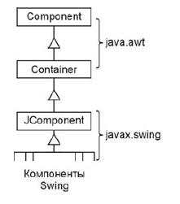
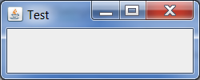
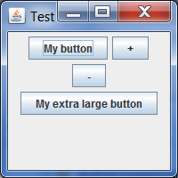
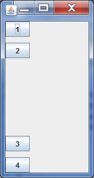

## Swing

### Java AWT

Библиотека AWT (Abstract Window Toolkit) — инструментарий для работы с различными оконными средами. 

Это прослойка на Java, которая вызывает методы из системных библиотек. Компоненты AWT не выполняют никакой "работы". Это просто «Java-оболочка» для элементов управления той операционной системы, на которой они работают. Все запросы к этим компонентам перенаправляются к операционной системе, которая и выполняет всю работу.

### Swing

Swing - библиотека для разработки графического пользовательского интерфейса на Java использующая AWT.

Важнейшим отличием Swing от AWT является то, что компоненты Swing вообще не связаны с операционной системой. Такие компоненты в Java называются легковесными (lightweight).



Swing позволяет создавать новые компоненты, наследуясь от существующих, и поддерживает различные стили.

### Swing контейнеры высшего уровня

Для создания графического интерфейса приложения необходимо использовать специальные компоненты библиотеки Swing, называемые контейнерами высшего уровня (top level containers). Они представляют собой окна операционной системы, в которых размещаются компоненты пользовательского интерфейса. К контейнерам высшего уровня относятся окна JFrame и JWindow, диалоговое окно JDialog.

### Окно JFrame

Каждая GUI-программа запускается в окне и по ходу работы может открывать несколько дополнительных окон.

В библиотеке Swing описан класс JFrame, представляющий собой окно с рамкой и строкой заголовка (с кнопками «Свернуть», «Во весь экран» и «Закрыть»). Оно может изменять размеры и перемещаться по экрану.

#### Об окнах Swing

Чтобы написать простейшую программу, выводящую на экран окно, потребуется несколько методов:

**setSize(int width, int height)** — устанавливает размеры окна. Если не задать размеры, окно будет иметь нулевую высоту независимо от того, что в нем находится и пользователю после запуска придется растягивать окно вручную. Размеры окна включают не только «рабочую» область, но и границы и строку заголовка.

**setDefaultCloseOperation(int operation)** — позволяет указать действие, которое необходимо выполнить, когда пользователь закрывает окно нажатием на крестик. Обычно в программе есть одно или несколько окон при закрытии которых программа прекращает работу. Для того, чтобы запрограммировать это поведение, следует в качестве параметра operation передать константу EXIT_ON_CLOSE (HIDE_ON_CLOSE, DISPOSE_ON_CLOSE), описанную в классе JFrame.

**setVisible(boolean visible)** — когда окно создается, оно по умолчанию невидимо. Чтобы отобразить окно на экране, вызывается данный метод с параметром true. Если вызвать его с параметром false, окно снова станет невидимым.

```
import java.awt.Dimension;

import javax.swing.JFrame;
import javax.swing.JLabel;

public class JFrameTest
{
  public static void createGUI()
  {
    JFrame frame = new JFrame("Test frame");
    frame.setDefaultCloseOperation(JFrame.EXIT_ON_CLOSE);
    
    JLabel label = new JLabel("Test label");
    frame.getContentPane().add(label);
    
    frame.setPreferredSize(new Dimension(200, 100));
    
    frame.pack();
    frame.setVisible(true);          
  }
  
  public static void main(String[] args)
  {
    JFrame.setDefaultLookAndFeelDecorated(true);
    javax.swing.SwingUtilities.invokeLater(new Runnable() {
      public void run() {
        createGUI();
      }
    });
  }
}
```



### Панель содержимого JFrame

Напрямую в окне элементы управления не размещаются. Для этого служит панель содержимого, занимающая все пространство окна. Обратиться к этой панели можно методом getContentPane() класса JFrame. С помощью метода add(Component component) можно добавить на нее любой элемент управления.

```
    JFrameTest(){
        super("Test");
        setDefaultCloseOperation(EXIT_ON_CLOSE);
        setSize(250, 100);
        JButton newButton = new JButton("Ok");
        getContentPane().add(newButton);
    }
```

### Класс Container (контейнер)

Элементы, которые содержат другие элементы, называются контейнерами. Все они являются потомками класса Container и наследуют от него ряд методов:

- add(Component component) — добавляет в контейнер элемент component;
- remove(Component component) — удаляет из контейнера элемент component;
- removeAll() — удаляет все элементы контейнера;
- getComponentCount() — возвращает число элементов контейнера.

### Класс JPanel (панель)

Панель JPanel — это элемент управления, представляющий собой прямоугольное пространство, на котором можно размещать другие элементы. Элементы добавляются и удаляются методами, унаследованными от класса Container.

У каждой панели есть менеджер размещения, который определяет стратегию взаимного расположения элементов, добавляемых на панель. Его можно изменить методом setLayout(LayoutManager manager).

### Менеджер последовательного размещения FlowLayout

Размещает добавляемые на панель компоненты строго по очереди, строка за строкой, в зависимости от размеров панели. Как только очередной элемент не помещается в текущей строке, он переносится на следующую.

```
import java.awt.FlowLayout;
import javax.swing.JButton;
import javax.swing.JFrame;
import javax.swing.JPanel;

public class MyWindow extends JFrame {
    MyWindow(){
        super("Test");
        setDefaultCloseOperation(EXIT_ON_CLOSE);
        setSize(200, 200);

        JPanel panel = new JPanel();
        panel.setLayout(new FlowLayout());
        panel.add(new JButton("My button"));
        panel.add(new JButton("+"));
        panel.add(new JButton("-"));
        panel.add(new JButton("My extra large button"));
        setContentPane(panel);
    }

    public static void main (String [] args) {
        JFrame myWindow = new MyWindow();
        myWindow.setVisible(true);
    }
}
```



### Менеджер граничного размещения BorderLayout

Менеджер размещения BorderLayout разделяет панель на пять областей:

- центральную (CENTER) 
- верхнюю (NORTH) 
- нижнюю (SOUTH)
- правую (EAST)
- левую (WEST)

В каждую из этих областей можно добавить ровно по одному компоненту, причем компонент будет занимать всю отведенную для него область.

```
SimpleWindow() {
  getContentPane().add(
    new JButton("1"), BorderLayout.NORTH);
  getContentPane().add(
    new JButton("2"), BorderLayout.EAST);
  getContentPane().add(
    new JButton("3"), BorderLayout.WEST);
  getContentPane().add(
    new JButton("4"), BorderLayout.SOUTH);
  getContentPane().add(
    new JButton("5"));
}
```

> Панель содержимого JFrame имеет по умолчанию именно такое расположение, именно поэтому кнопка и занимала все окно целиком (она была добавлена в центральную область).

### Менеджер табличного размещения GridLayout

GridLayout разбивает панель на ячейки одинаковой ширины и высоты (таким образом окно становится похожим на таблицу). Каждый элемент, добавляемый на панель с таким расположением, целиком занимает одну ячейку. Ячейки заполняются элементами по очереди, начиная с левой верхней. В конструкторе необходимо указать количество столбцов, строк и расстояние между ячейками по горизонтали и по вертикали.

```
SimpleWindow(){
  JPanel panel = new JPanel();
  panel.setLayout(new GridLayout(2, 3, 5, 10));
  panel.add(new JButton("1"));
  panel.add(new JButton("2"));
  panel.add(new JButton("3"));
  panel.add(new JButton("4"));
  panel.add(new JButton("5"));
  setContentPane(panel);
}
```

### Менеджер блочного размещения BoxLayout и класс Box

Менеджер BoxLayout размещает элементы на панели в строку или в столбец.

Обычно для работы с этим менеджером используют вспомогательный класс Box, представляющий собой панель, для которой уже настроено блочное размещение. Создается такая панель не конструктором, а одним из двух статических методов, определенных в классе Box: createHorizontalBox() и createVerticalBox().

Элементы, добавленные на панель с блочным размещением, выстраиваются один за другим. Расстояние между элементами по умолчанию нулевое. Однако вместо компонента можно добавить невидимую «распорку», единственная задача которой — раздвигать соседние элементы, обеспечивая между ними заданное расстояние. Горизонтальная распорка создается статическим методом createHorizontalStrut(int width), а вертикальная — методом createVerticalStrut(int height). Оба метода определены в классе Box, а целочисленный параметр в каждом из них определяет размер распорки.

Кроме того, на такую панель можно добавить еще один специальный элемент — своеобразную «пружину». Если размер панели будет больше, чем необходимо для оптимального размещения всех элементов, те из них, которые способны растягиваться, будут стараться заполнить дополнительное пространство собой. Если же разместить среди элементов одну или несколько «пружин», дополнительное свободное пространство будет распределяться и в эти промежутки между элементами. Горизонтальная и вертикальная пружины создаются соответственно методами createHorizontalGlue() и createVerticalGlue().

```
SimpleWindow(){
  Box box = Box.createVerticalBox();
  box.add(new JButton("1"));
  box.add(Box.createVerticalStrut(10));
  box.add(new JButton("2"));
  box.add(Box.createVerticalGlue());
  box.add(new JButton("3"));
  box.add(Box.createVerticalStrut(10));
  box.add(new JButton("4"));
}
```



### Автоматическое определение размеров компонентов

Каждый визуальный компонент имеет три типа размеров: минимально допустимый, максимально допустимый и предпочтительный. Узнать, чему равны эти размеры для данного компонента можно с помощью соответствующих методов:
- getMinimumSize(),
- getPreferredSize(),
- getMaximumSize().

Они запрограммированы в соответствующем классе. Например, у кнопки минимальный размер — нулевой, максимальный размер не ограничен, а предпочтительный зависит от надписи на кнопке (вычисляется как размер текста надписи плюс размеры полей).

Менеджер FlowLayout всегда устанавливает предпочтительные размеры элементов.

Менеджер BorderLayout устанавливает предпочтительную ширину правого и левого, а также предпочтительную высоту верхнего и нижнего. Остальные размеры подгоняются под доступное пространство панели. 

Менеджер GridLayout пытается подогнать размеры всех элементов под размер ячеек. 

Менеджер BoxLayout ориентируется на предпочтительные размеры.

Всеми тремя размерами можно управлять с помощью соответствующим методов set:
- setMinimumSize(Dimension size),
- setPreferredSize(Dimension size),
- setMaximumSize(Dimension size).

Чаще всего используется простой прием, когда элементу «не рекомендуется» увеличиваться или уменьшаться относительно своих предпочтительных размеров:

```
element.setMinimumSize(element.getPreferredSize());
```

## Основные визуальные компоненты Swing

### Класс JComponent

Все визуальные компоненты библиотеки Swing унаследованы от класса JComponent. Сам этот класс является абстрактными и непосредственно не используется, но все визуальные компоненты наследуют его методы.

- setEnabled(boolean enabled) используется для управления активностью компонента. При вызове этого метода с параметром false компонент переходит в неактивное состояние. Для каждого наследника JComponent эта «неактивность» может быть переопределена по-разному. Например, неактивная кнопка не нажимается, не реагирует на наводящуюся мышь и отображается монохромным серым цветом. Метод isEnabled() возвращает true, если элемент активен и false в противном случае.
- setVisible(boolean visible) управляет видимостью компонента. Большинство элементов управления, в отличие от окна, по умолчанию являются видимыми (поэтому мы не вызывали данный метод после создания кнопок в примерах предыдущей главы). Метод isVisible() возвращает false, если элемент невидим и true в противном случае.

### Метка JLabel

Метка позволяет отобразить изображение, текст, HTML.

- JLabel(String text) — создает метку с надписью text
- JLabel(Icon image) — создает метку со значком image
- JLabel(String text, Icon image, int align) — создает метку с надписью text и значком image. Третий параметр задает выравнивание текста (LEFT, RIGHT, CENTER) вместе со значком..

```
SimpleWindow(){
  JLabel label = new JLabel("text", 
    new ImageIcon("1.gif"), 
    SwingConstants.RIGHT);
  getContentPane().add(label);
}
```

```
JLabel label = new JLabel(
  "<html><ul><li><i>1</i></li><li><b>2</b></li></ul></html>");
```

Основные методы класса JLabel:
- getText() — возвращает текущий текст надписи метки
- setText(String text) — задает новый текст надписи
- getIcon() — возвращает значок метки
- setIcon(Icon image) — устанавливает новый значок.
- getVerticalAlignment(), setVerticalAlignment(int align), getHorizontalAlignment(), setHorizontalAlignment(int align) — эти четыре метода позволяют получить текущее или установить новое выравнивание (по горизонтали и вертикали) метки относительно ее границ.
- getVerticalTextPosition(), setVerticalTextPosition(int align), getHorizontalTextPosition(), setHorizontalTextPosition(int align) — эти четыре метода позволяют получить текущее или установить новое выравнивание текста относительно значка.
- getIconTextGap(), setIconTextGap(int gap) — позволяет получить или задать расстояние между текстом и значком метки в пикселах.

### Кнопка JButton

Кнопка — это прямоугольник с текстом (и/или значком), по которому пользователь щелкает, когда хочет выполнить какое-то действие (или о чем-то сигнализировать).

Кнопка создается одним из конструкторов:
- JButton(), 
- JButton(String text), 
- JButton(Icon icon), 
- JButton(String text, Icon icon)

Кроме обычного значка можно назначить кнопке еще несколько — для различных состояний. Метод setRolloverIcon(Icon icon) позволяет задать значок, который будет появляться при наведении на кнопку мыши, setPressedIcon(Icon icon) — значок для кнопки в нажатом состоянии, setDisableIcon(Icon icon) — значок для неактивной кнопки. Каждому из этих методов соответствует метод get.

Метод setMargin(Insets margin) позволяет задать величину отступов от текста надписи на кнопке до ее полей. Объект класса Insets, который передается в этот метод, может быть создан конструктором с четырьмя целочисленными параметрами, задающими величину отступов: Insets(int top, int left, int bottom, int right). Метод getMargin() возвращает величину текущих отступов в виде объекта того же класса.

Все методы класса JLabel, описанные в предыдущем разделе, присутствуют и в классе JButton. С помощью этих методов можно изменять значок и текст надписи на кнопке, а также управлять их взаимным расположением друг относительно друга и относительно края кнопки (с учетом отступов).

Посредством методов setBorderPainted(boolean borderPainted), setFocusPainted(boolean focusPainted), setContentAreaFilled(boolean contentAreaFilled) можно отключать (параметром false) и включать обратно (параметром true) прорисовку рамки, прорисовку фокуса (кнопка, на которой находится фокус, выделяется пунктирным прямоугольником) и закраску кнопки в нажатом состоянии.

### Компоненты JToggleButton, JCheckBox, JRadioButton

Компонент JToggleButton представляет собой кнопку, которая может находиться в двух состояниях: нажатом и отпущенном. Когда пользователь щелкает мышкой по такой кнопке, она изменяет свое состояние.

Основной конструктор — JToggleButton(String text, Icon icon, boolean selected) создает кнопку с заданными надписью, значком и текущим состоянием. Кнопку можно перевести в требуемое состояние программным путем, вызвав метод setSelected(boolean selected). Метод isSelected() возвращает true, если кнопка выбрана (т.е. находится в нажатом состоянии) и false в противном случае.

От класса JToggleButton унаследован класс JCheckBox — флажок. Этот класс имеет точно такой же набор конструкторов и методов, т.е. не расширяет функциональность предка. Единственное различие между ними — во внешнем виде: JCheckBox выглядит не как кнопка, а как небольшой квадратик, в котором можно поставить или убрать галочку.

Аналогичным образом ведет себя класс JRadioButton — переключатель или радиокнопка, внешне выглядящая как пустой кружок, когда она не выделена и кружок с точкой в выделенном состоянии.

Несмотря на то, что классы JCheckBox и JRadioButton ведут себя абсолютно одинаково (и аналогично их общему предку JToggleButton), их принято использовать в различных ситуациях. В частности, JRadioButton предполагает выбор единственной альтернативы из нескольких возможных: несколько таких объектов объединяются в одну группу (чаще всего эта группа визуально обозначается рамкой) и при выборе одного из элементов группы предыдущий выбранный элемент переходит в состояние «не выбран».

Для того, чтобы получить такое поведение, используется специальный контейнер ButtonGroup — взаимоисключающая группа (создается конструктором без параметров). Если добавить в один такой контейнер несколько элементов JRadioButton, то выбранным всегда будет только один из них.

Метод add(AbstractButton button)* добавляет элемент в группу. Метод getElements() возвращает все ее элементы в виде коллекции Enumeration. По коллекции можно пройтись итератором и найти выделенный элемент.

```
SimpleWindow() {
  JRadioButton rb1 = new JRadioButton("1");
  JRadioButton rb2 = new JRadioButton("2");
  
  ButtonGroup group = new ButtonGroup();
  group.add(rb1);
  group.add(rb2);
  
  Box box = Box.createVerticalBox();
  box.add(rb1);
  box.add(rb2);
  
  setContentPane(box);
}
```

### Текстовое поле JTextField

Текстовое поле предназначено для ввода небольших по объему (записываемых в одну строку) текстовых данных.

- JTextField(int columns) — создает пустое текстовое поле, ширина которого достаточна для размещения columns символов. При этом пользователь может вводить в текстовое поле строку какой угодно длины: она просто будет прокручиваться.
- JTextField(String text) — создает текстовое поле с начальным текстом text.
- JTextField(String text, int columns) — устанавливает и ширину и начальный текст.

Занести текст в поле можно методом setText(String text). Метод getText() возвращает содержимое текстового поля.

По умолчанию текст в поле прижимается к левому краю. Изменить это можно методом setHorizontalAlignment(int align), в качестве параметра передается одна из констант выравнивания, определенных в этом же классе JTextField: LEFT, CENTER, RIGHT.

### Поле для ввода пароля JPasswordField

JPasswordField является прямым потомком JTextField, поэтому для него справедливо все сказанное выше. Отличие заключается в том, что весь введенный в него текст заменяется звездочками или другим символом, установить который позволяет метод setEchoChar(char echo), а получить — getEchoChar().

### Область для ввода текста JTextArea

JTextArea также является потомком JTextField и наследует все его методы. В отличие от текстового поля область для ввода текста позволяет ввести не одну строку, а несколько. В связи с этим JTextArea предлагает несколько дополнительных функций. 

Во-первых, это способность переносить слова на соседнюю строку целиком, которой управляет метод setWrapStyleWord(boolean wrapStyle). Если вызвать этот метод с параметром true, то слова не будут разрываться в том месте, где они «натыкаются» на границу компонента, а будут целиком перенесены на новую строку. 

Во-вторых, это способность переносить текст (то есть длинные строки будут укладываться в несколько строк вместо одной, уходящей за границы компонента. Этой способностью управляет метод setLineWrap(boolean lineWrap). Методы isWrapStyleWord() и isLineWrap() возвращают текущее состояние данных способностей (true — активирована и false — деактивирована).

При создании JTextArea чаще всего используют конструктор JTextArea(int rows, int columns), устанавливающий высоту (количество строк) и ширину (количество символов) компонента.

Для работы со своим содержимым JTextArea дополнительно предлагает два удобных метода. Метод append(String text) добавляет строку text в конец уже имеющегося текста, а метод insert(String text, int position) вставляет ее в позицию position.

### Выпадающий список JComboBox

Создать выпадающий список можно конструктором по умолчанию JComboBox(), после чего добавлять в него элементы методом addItem(Object item), добавляющим новый элемент в конец списка, или методом insertItemAt(Object item, int index), позволяющим уточнить позицию, в которую требуется вставить элемент.

Однако проще использовать конструктор, в котором сразу указываются все элементы выпадающего списка. Таких конструкторов два: JComboBox(Object[] elements) и JComboBox(Vector elements). Работают они одинаково, так что это вопрос удобства разработчика: использовать массив или вектор.

Чаще всего в выпадающий список добавляют строки, однако, как это следует из сигнатур описанных выше методов, он может содержать вообще любые объекты. Любой объект преобразуется к строке методом toString(), именно эта строка и будет представлять его в выпадающем списке.

Метод getItemAt(int index) позволяет обратиться к произвольному элементу.

Метод removeAllItems() удаляет из JComboBox все элементы, а метод removeItem(Object item) — конкретный элемент (при условии, что он содержался в списке).

Метод getSelectedIndex() позволяет получить индекс выбранного пользователем элемента (элементы нумеруются начиная с нуля), а метод getSelectedItem() возвращает сам выбранный объект. 

Сделать конкретный элемент выбранным можно и программно, воспользовавшись методом setSelectedIndex(int index) или setSelectedItem(Object item).

Чтобы пользователь мог ввести свой вариант, который не присутствует в списке, должен быть вызван метод setEditable(boolean editable) с параметром true. Ему соответствует метод isEditable().

```
SimpleWindow() {
  String[] elements = new String[] { "Вася", "Петя" };
  JComboBox combo = new JComboBox(elements);
  combo.setSelectedIndex(1);
}
```

### Ползунок JSlider

Ползунок позволяет пользователю выбрать некоторое число из диапазона доступных значений, наглядно представив этот диапазон.

Основной конструктор ползунка: JSlider(int orientation, int min, int max, int value). Первый параметр — ориентация ползунка (HORIZONTAL или VERTICAL). Остальные параметры указывают соответственно минимальное, максимальное и текущее значение. 

Изменить эти значения позволяют методы setOrientation(int), setMinimum(int min), setMaximum(int max), setValue(int value), а получить текущие — соответствующие им методы get.

Шкала ползунка может быть украшена делениями. Метод setMajorTickSpacing(int spacing) позволяет задать расстояние, через которое будут выводиться большие деления, а метод setMinorTickSpacing(int spacing) — расстояние, через которые будут выводиться маленькие деления. Метод setPaintTicks(boolean paint) включает или отключает прорисовку этих делений. Метод setSnapToTicks(boolean snap) включает или отключает «прилипание» ползунка к делениям: если вызвать этот метод с параметром true, пользователь сможет выбрать при помощи ползунка только значения, соответствующие делениям. Наконец, метод setPaintLabels(boolean paint) включает или отключает прорисовку меток под большими делениями.

```
SimpleWindow(){
  JSlider slider = new JSlider(JSlider.HORIZONTAL, 50, 150, 70);
  slider.setMajorTickSpacing(20);
  slider.setMinorTickSpacing(5);
  slider.setPaintTicks(true);
  slider.setPaintLabels(true);
  slider.setSnapToTicks(true);
}
```

## Обработка событий в Swing

### Паттерн проектирования «наблюдатель»

В библиотеке Swing для привязки обработчика события к вызывающему его компоненту используется паттерн проектирования «наблюдатель».

Паттерн проектирования «наблюдатель» применяется, когда один объект должен оповещать другие о произошедших с ним изменениях или внешних воздействиях. Такой объект называется наблюдаемым, а объекты, которые следует оповестить — наблюдателями.

Для того, чтобы подобное взаимодействие было возможным, объект-наблюдатель должен иметь метод (или несколько методов) с заранее определенной сигнатурой (именем и параметрами). Когда с наблюдаемым объектом произойдет ожидаемое событие, он вызовет соответствующий метод у своего наблюдателя. В этом методе и будет запрограммирована реакция на событие.

Для того, чтобы наблюдаемый объект мог вызвать метод наблюдателя, он должен знать о том, что такой наблюдатель существует. Поэтому у наблюдаемого предварительно должен быть вызван специальный метод, регистрирующий его наблюдателя.

### Механизм обработки событий библиотеки Swing

В контексте графического интерфейса пользователя наблюдаемыми объектами являются элементы управления: кнопки, флажки, меню и т.д. Они могут сообщить своим наблюдателям об определенных событиях, как элементарных (наведение мышкой, нажатие клавиши на клавиатуре), так и о высокоуровневых (изменение текста в текстовом поле, выбор нового элемента в выпадающем списке и т.д.).

Наблюдателями должны являться объекты классов, поддерживающих специальные интерфейсы (вспомним, что в классе наблюдателя должны быть определенные методы, о которых «знает» наблюдаемый и вызывает их при наступлении события). Такие классы в терминологии Swing называются слушателями.

### Интерфейс MouseListener и обработка событий от мыши

События от мыши — один из самых популярных типов событий. Практически любой элемент управления способен сообщить о том, что на него навели мышь, щелкнули по нему и т.д. Об этом будут оповещен все зарегистрированные слушатели событий от мыши.

Слушатель событий от мыши должен реализовать интерфейс **MouseListener**. В этом интерфейсе перечислены следующие методы:
- public void mouseClicked(MouseEvent event) — выполнен щелчок мышкой на наблюдаемом объекте
- public void mouseEntered(MouseEvent event) — курсор мыши вошел в область наблюдаемого объекта
- public void mouseExited(MouseEvent event) — курсор мыши вышел из области наблюдаемого объекта
- public void mousePressed(MouseEvent event) — кнопка мыши нажата в момент, когда курсор находится над наблюдаемым объектом
- public void mouseReleased(MouseEvent event) — кнопка мыши отпущена в момент, когда курсор находится над наблюдаемым объектом

#### О параметре типа MouseEnent

Чтобы обработать нажатие на кнопку, требуется описать класс, реализующий интерфейс MouseListener, причем метод mouseClicked() должен содержать обработчик события.

Далее необходимо создать объект этого класса и зарегистрировать его как слушателя интересующей нас кнопки. Для регистрации слушателя используется метод addMouseListener(MouseListener listener).

```
import java.awt.event.MouseEvent;
import java.awt.event.MouseListener;

class MyMouseListener implements MouseListener {
  public void mouseClicked(MouseEvent event) {}
  public void mouseEntered(MouseEvent event) {}
  public void mouseExited(MouseEvent event) {}
  public void mousePressed(MouseEvent event) {}
  public void mouseReleased(MouseEvent event) {}
}


public class MyWindow extends JFrame {
  MyWindow(){
    button.addMouseListener(new MyMouseListener());
  }
}
```

### Класс MouseAdapter

Класс MouseAdapter реализует интерфейс MouseListener, определяя пустые реализации для каждого из его методов. Можно унаследовать своего слушателя от этого класса и переопределить те методы, которые нам нужны.

```
public class MyWindow extends JFrame {
  MyWindow(){
    button.addMouseListener(new MouseAdapter() {
      public void mouseClicked(MouseEvent event) {
      }
    });
  }
}
```

### Общая структура слушателей

Кроме слушателей MouseListener визуальные компоненты Swing поддерживают целый ряд других слушателей.

Каждый слушатель должен реализовывать интерфейс ***Listener, где *** — тип слушателя. Практически каждому из этих интерфейсов (за исключением тех, в которых всего один метод) соответствует пустой класс-заглушка ***Adapter. Каждый метод интерфейса слушателя принимает один параметр типа ***Event, в котором собрана вся информация, относящаяся к событию.

Чтобы привязать слушателя к объекту (который поддерживает соответствующий тип слушателей) используется метод add***Listener(***Listener listener).

Например, слушатель MouseListener должен реализовать интерфейс с таким же именем, которому соответствует класс-заглушка MouseAdapter. Методы этого интерфейса обрабатывают параметр типа MouseEvent, а регистрируется слушатель методом addMouseListener(MouseListener listener).

### Слушатель фокуса FocusListener

Слушатель FocusListener отслеживает моменты, когда объект получает фокус (то есть становится активным) или теряет его. 

Концепция фокуса очень важна для оконных приложений. В каждый момент времени в окне может быть только один активный (находящийся в фокусе) объект, который получает информацию о нажатых на клавиатуре клавишах (т.е. реагирует на события клавиатуры), о прокрутке колесика мышки и т.д. Пользователь активирует один из элементов управления нажатием мышки или с помощью клавиши Tab (переключаясь между ними).

Интерфейс FocusListener имеет два метода:

- public void focusGained(FocusEvent event) — вызывается, когда наблюдаемый объект получает фокус
- public void focusLost(FocusEvent event) — вызывается, когда наблюдаемый объект теряет фокус.

### Слушатель колесика мышки MouseWheelListener

Слушатель MouseWheelListener оповещается при вращении колесика мыши в тот момент, когда данный компонент находится в фокусе. Этот интерфейс содержит всего один метод:

- public void mouseWheelMoved(MouseWheelEvent event).

### Слушатель клавиатуры KeyListener

Слушатель KeyListener оповещается, когда пользователь работает с клавиатурой в тот момент, когда данный компонент находится в фокусе. В интерфейсе определены методы:

- public void mouseKeyTyped(KeyEvent event) — вызывается, когда с клавиатуры вводится символ
- public void mouseKeyPressed(KeyEvent event) — вызывается, когда нажата клавиша клавиатуры
- public void mouseKeyReleased(KeyEvent event) — вызывается, когда отпущена клавиша клавиатуры.

Аргумент event этих методов способен дать весьма ценные сведения: 

- getKeyChar() возвращает символ типа char, связанный с нажатой клавишей. Если с нажатой клавишей не связан никакой символ, возвращается константа CHAR_UNDEFINED. 
- event.getKeyCode() возвратит код нажатой клавиши в виде целого числа типа int. Его можно сравнить с одной из многочисленных констант, определенных в классе KeyEvent: VK_F1, VK_SHIFT, VK_D, VK_MINUS и т.д. 
- isAltDown(), isControlDown(), isShiftDown() позволяют узнать, не была ли одновременно нажата одна из клавиш-модификаторов Alt, Ctrl или Shift.

### Слушатель изменения состояния ChangeListener

Слушатель ChangeListener реагирует на изменение состояния объекта. Каждый элемент управления по своему определяет понятие «изменение состояния». Например, для ползунка JSlider — изменение его положения, кнопка JButton рассматривает как смену состояния щелчок на ней. В интерфейсе определен всего один метод:

- public void stateChanged(ChangeEvent event).

### Слушатель выбора элемента ItemListener

Слушатель ItemListener реагирует на изменение состояния одного из элементов, входящих в состав наблюдаемого компонента. Например, выпадающий список JComboBox состоит из множества элементов и слушатель реагирует, когда изменяется выбранный элемент. Также данный слушатель оповещается при выборе либо отмене выбора флажка JCheckBox или переключателя JRadioButton, изменении состояния кнопки JToggleButton и т.д. Слушатель обладает одним методом:

- public void itemStateChanged(ItemEvent event).

## Стандартные диалоговые окна

### Класс JOptionPane

Метод showMessageDialog() выводит на экран диалоговое окно, информирующее пользователя. Оно содержит надпись, значок и кнопку ОК. Существует несколько разновидностей этого метода с разными наборами параметров. Самый простой из них showMessageDialog(Component component, Object content) требует указания компонента, над которым должно появиться диалоговое окно и содержимого окна.

Чаще всего содержимым окна является некоторая строка, а вместо первого параметра передается null — тогда окно появляется по центру экрана. 

Более «продвинутый» вариант showMessageDialog(Component component, Object content, String title, int type) позволяет задать также свой заголовок окна и выбрать его тип (влияет на иконку в окне): 
- сообщение об ошибке (ERROR_MESSAGE), 
- предупреждение (WARNING_MESSAGE), 
- информация (INFORMATION_MESSAGE).

Диалоговое окно является модальным. Это значит, что пока пользователь не нажмет в этом окне кнопку OK, программа окажется заблокирована — пользователь не сможет работать с другими окнами.

```
button = new JButton("Info");
button.addActionListener(new ActionListener() {
  public void actionPerformed(ActionEvent event) {
    JOptionPane.showMessageDialog(
      button, "Text", "Caption", JOptionPane.WARNING_MESSAGE);
  }
});
```

Другое часто используемое диалоговое окно — окно вопроса. В этом окне несколько кнопок, одну из которых пользователь должен нажать. В программу, вызывающую это диалоговое окно, возвращается информация о выборе пользователя, на основе которой и строится дальнейший ход работы программы.

Данное окно отображается методом showConfirmDialog(Component component, Object content). Параметры этого метода идентичны по смыслу параметрам showMessageDialog(), но в диалоговом окне появится не одна кнопка, а три: «Yes», «No» и «Cancel». Более того, метод возвращает значение, которое можно сравнить с константами YES_OPTION, NO_OPTION и CANCEL_OPTION.